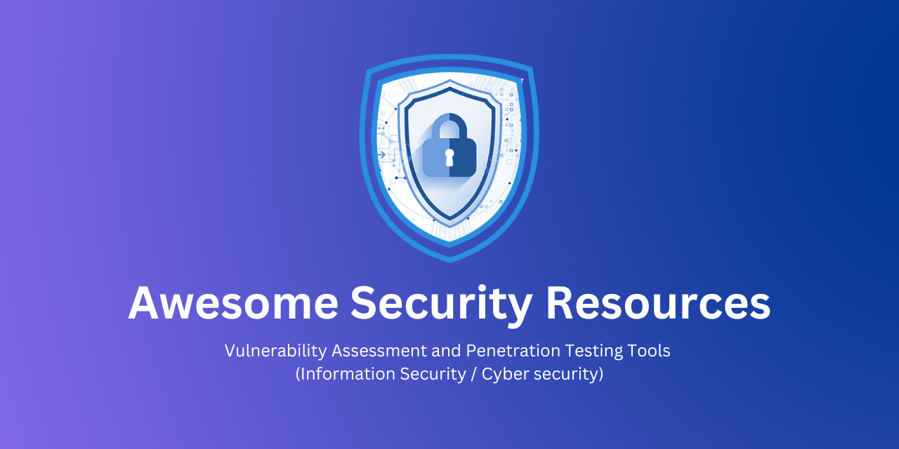

# HACKTOBERFEST-2022 🚀
> Add valuable resources that will help the community.

# 💡Always Welcome For Contribution!!
Check the contribution [RULES](/CONTRIBUTING.md) 

## Vulnerability Assesment and Penetration Testing

- [Directory Bruteforce Tools](/Directory%20Bruteforce_Tools/README.md)
    - [Gobuster](/Directory%20Bruteforce_Tools/README.md)
    - [DirBuster](/Directory%20Bruteforce_Tools/README.md)
    - [Dirsearch](/Directory%20Bruteforce_Tools/README.md)

- [Email Address](/Email%20Address/)
    - [Discover Email Address](/Email%20Address/Discover%20Email%20Address/)
        - [Hunter.io](/Email%20Address/Discover%20Email%20Address/README.md)
        - [KnockMail](/Email%20Address/Discover%20Email%20Address/README.md)
        - [PhoneBook.cz](/Email%20Address/Discover%20Email%20Address/README.md)
        - [TheHarvester](/Email%20Address/Discover%20Email%20Address/README.md)
    - [Verify Email Address](/Email%20Address/Verify%20Email%20Address/)
        - [Email-Checker.net](/Email%20Address/Verify%20Email%20Address/README.md)

- [Identify Web Technologies](/Identify%20Web%20Technology/)
    - [BuiltWith.com](/Identify%20Web%20Technology/README.md)
    - [Wappalyzer](/Identify%20Web%20Technology/README.md)
    
- [Network Scanner](/Network%20Scanner/)
    - [Advanced Ip Scanner](/Network%20Scanner/README.md)
    - [Airbash](/Network%20Scanner/README.md)
    - [Bettercap](/Network%20Scanner/README.md)
    - [Metasploit Framework](/Network%20Scanner/README.md)
    - [Nessus](/Network%20Scanner/README.md)
    - [Nikto](/Network%20Scanner/README.md)
    - [Nmap](/Network%20Scanner/README.md)
    - [OWASP ZAP](/Network%20Scanner/README.md)
    - [Snort3](/Network%20Scanner/README.md)
    - [Unicornscan](/Network%20Scanner/README.md)
    - [Wireshark](/Network%20Scanner/README.md)
    - [WiFi Pumpkin](/Network%20Scanner/README.md)
  
- [Password Attacking Tools](/Password%20Attacking%20Tools/)
    - [Hashcat](/Password%20Attacking%20Tools/README.md)
    - [Hydra](/Password%20Attacking%20Tools/README.md)
    - [John the Ripper](/Password%20Attacking%20Tools/README.md)
    - [Ncrack](/Password%20Attacking%20Tools/README.md)
    - [Ophcrack](/Password%20Attacking%20Tools/README.md)
    
- [Search Engine](/Search%20Engine/)
    - [Dehashed](/Search%20Engine/README.md)
    - [Uncover](/Search%20Engine/README.md)
    
- [Sub Domain Enumeration](/Sub%20Domain%20Enumeration/)
    - [AssetFinder](/Sub%20Domain%20Enumeration/README.md)
    - [Amass](/Sub%20Domain%20Enumeration/README.md)
    - [Attdns](/Sub%20Domain%20Enumeration/README.md)
    - [CRT.sh](/Sub%20Domain%20Enumeration/README.md)
    - [Domain](/Sub%20Domain%20Enumeration/README.md)
    - [SecurityTrails](/Sub%20Domain%20Enumeration/README.md)
    - [SubFinder](/Sub%20Domain%20Enumeration/README.md)
    - [Sublist3r](/Sub%20Domain%20Enumeration/README.md)
 
- [Vulnerability Attacks](/Attacks/README.md)
    - [Clickjacking](/Attacks/README.md)
    - [CORS](/Attacks/README.md)
    - [IDOR](/Attacks/README.md)
    - [Local File Inclusion (LFI)](/Attacks/README.md)
    - [Session Hijacking](/Attacks/README.md)
    - [SQL Injection](/Attacks/README.md)
    - [Web Cache Poisoning](/Attacks/README.md)
    - [XSS](/Attacks/README.md)

## Datasets

- [Intrusion Detection System](/Intrusion%20Detection%20System/README.md)

## Free Learning Resources

- [CTF Challenge Resources](/Free%20Learning%20Resources/CTF%20Challenge%20Resources/README.md)
- [Cyber Security Courses](/Free%20Learning%20Resources/Cyber%20Security%20Courses/README.md)
- [Cyber Security News (Sites, Blogs, Feeds)](/Free%20Learning%20Resources/Cyber%20Security%20News/README.md)
- [Youtube Channel](/Free%20Learning%20Resources/Youtube%20Channel/README.md)

## License

[MIT License](LICENSE)

## Disclaimer

All the resources are for informational and educational purposes only. We believe that ethical hacking, information security and cyber security should be familiar subjects to anyone using digital information and computers. Don't misuse of the information and we strongly suggest against it. We do not promote, encourage, support or excite any illegal activity or hacking. We cannot be held responsible for any misuse of the given information.
